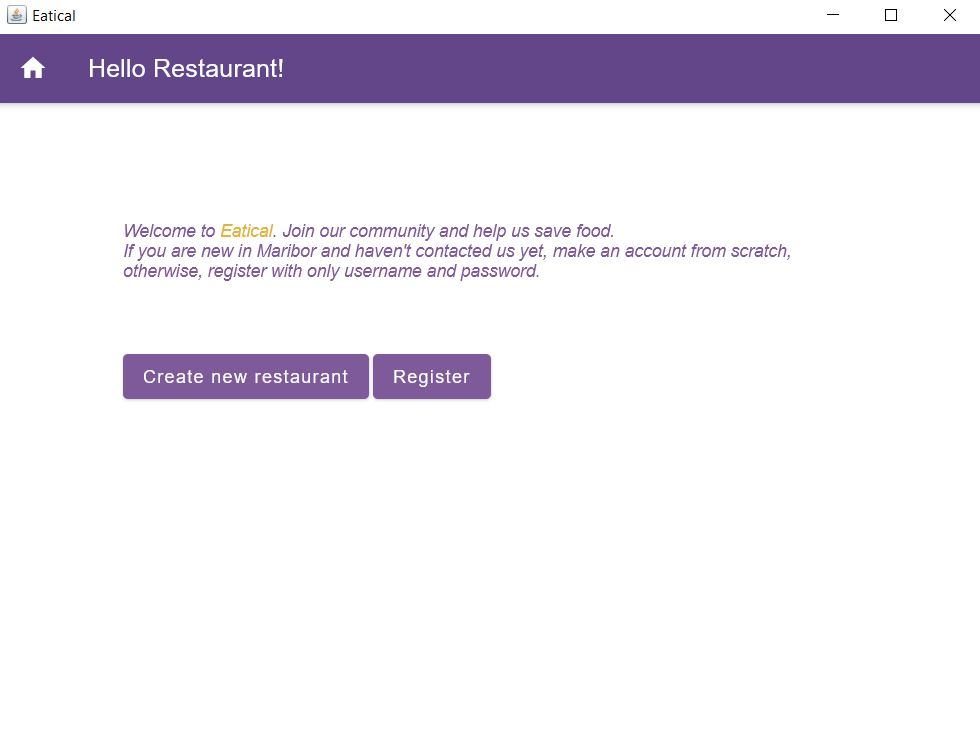
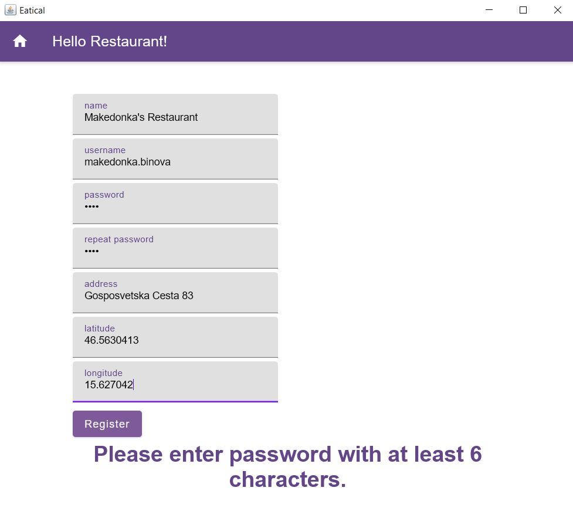
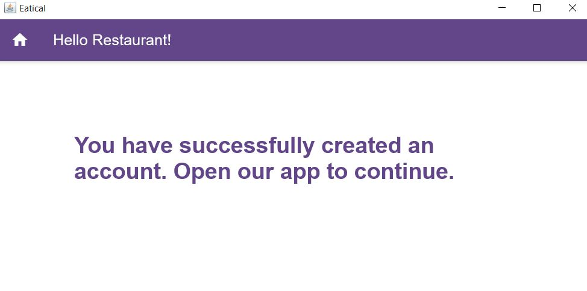
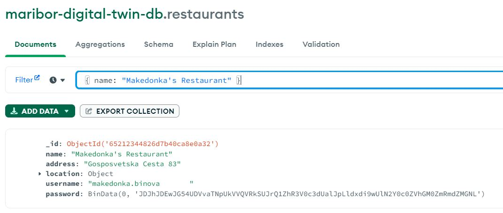
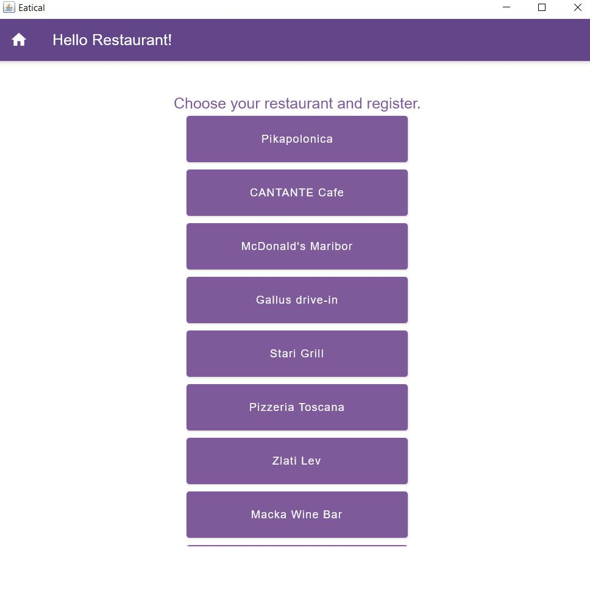
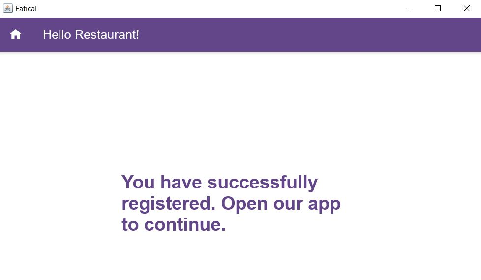
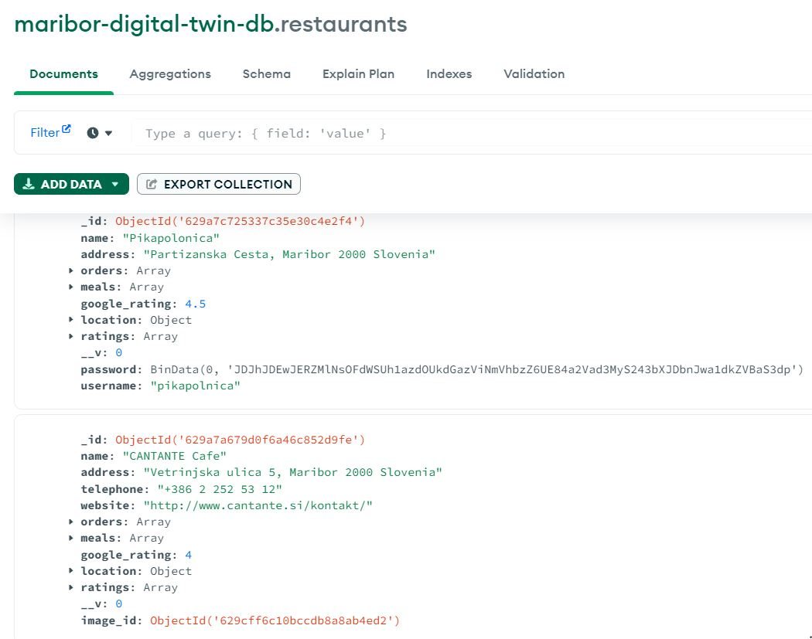

# Eatical Desktop App

In our [web application for Eatical](https://github.com/makedonkabinova/maribor-digital-twin), we only have the restaurants as they appear in TripAdvisor with the suitable info about them. However, the services that our application provides is restaurants being able to put up orders and customers to select them and order them. That's why we have two types of login in our web app.

Anyways, the desktop app's purpose is for creation of new restaurant that is not part of our application yet and for restaurants that are part of our community to set username and password (basically to register an account under the restaurants name and then the restaurant would be able to publish orders).

## Homepage

## Create new restaurant

We also have robustness for the creation of restaurant.

We can check in our database for our new restaurant.

## Register existing restaurant

### Choose from list of existing restaurants in our community

We also have robustness for the registration of existing restaurant.

We can check in our database for the account of the existing restaurant in our community.

